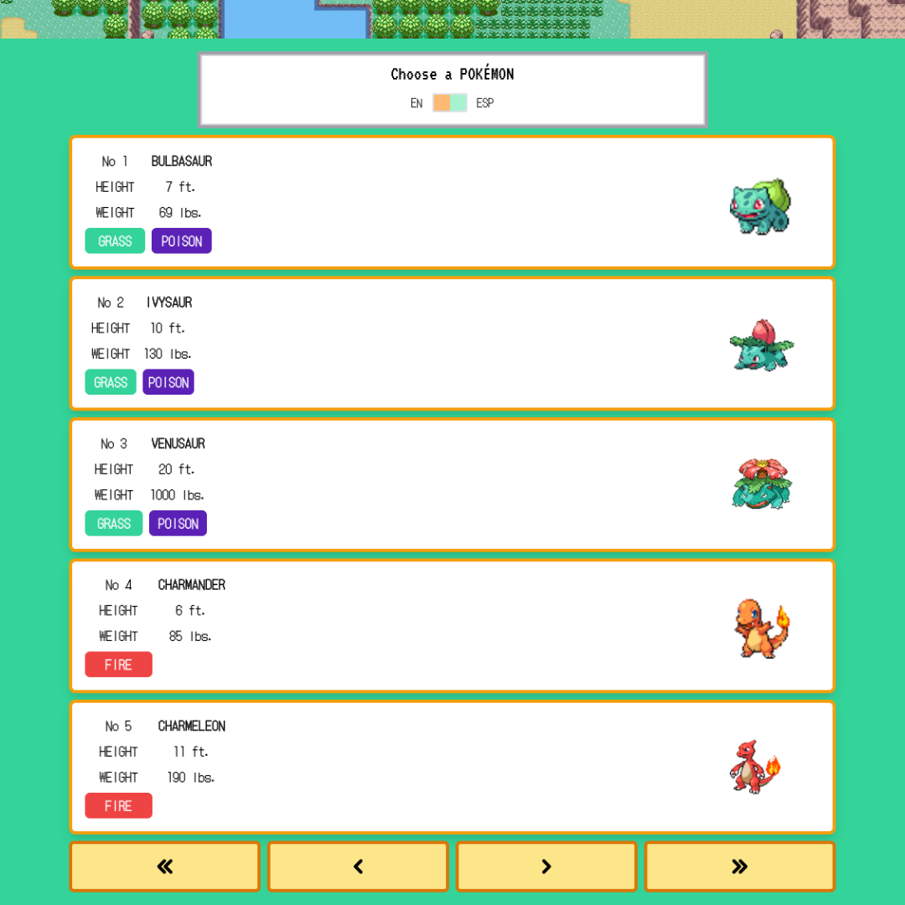
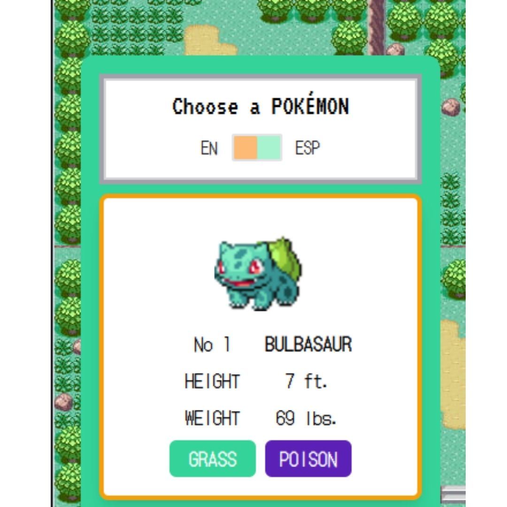
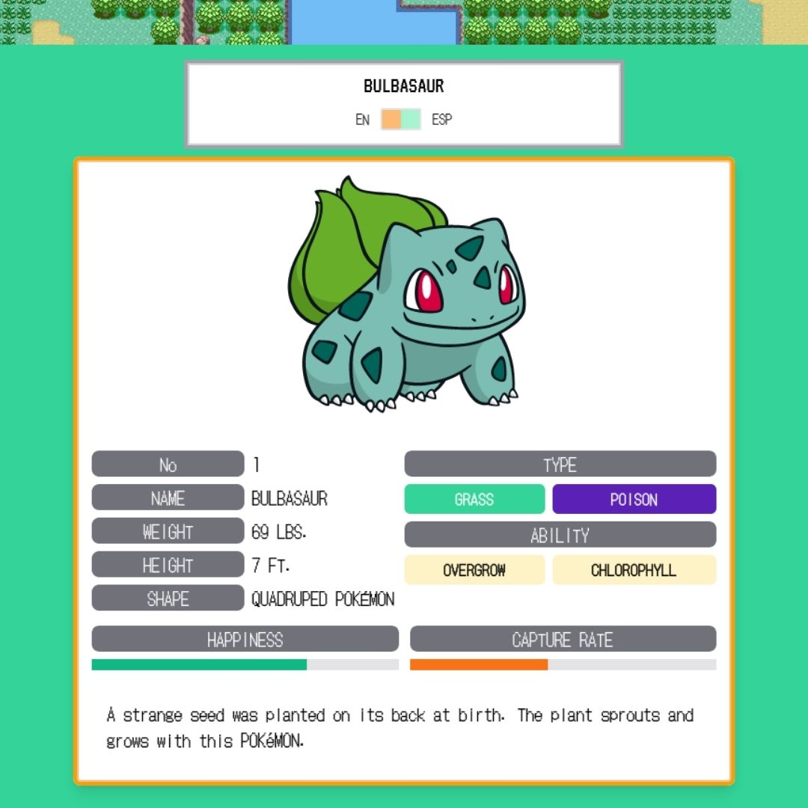
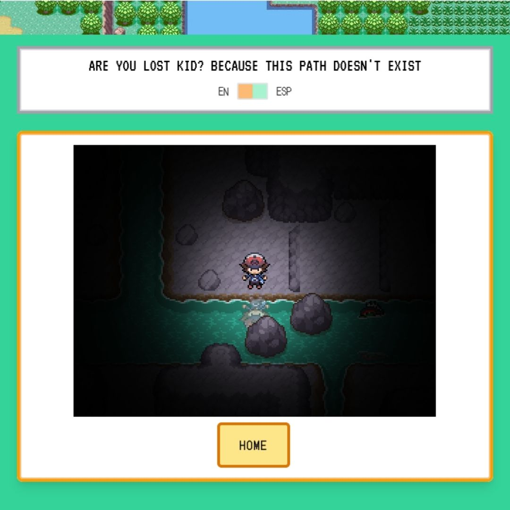

# PokeChallenge App

Este proyecto fue creado con Vue 3 usando [vue create](https://cli.vuejs.org/guide/creating-a-project.html) añadiendo [Vuex](https://vuex.vuejs.org/) y [Vue Router](https://router.vuejs.org/guide/) mediante [Vue CLI](https://cli.vuejs.org/guide/installation.html)

Link del deployment con [Firebase](https://pokechallenge-app.web.app/)

## Contenido

Este proyecto ha sido desarrollado como parte de una prueba tecnica en la cual tuve que desarrollar una App con Vue que pudiera consumir datos de [PokeAPI](https://pokeapi.co/docs/v2#pokemon) inspirado en los videojuegos de Pokemon de la GBA.

- SPA creada con Vue3 para el Front End.
- Vuex para el manejo de estados.
- TailwindCSS para los estilos.
- Consumo de datos de PokeAPI para el paginado de pokemones la busqueda de detalles, tipos y habilidades.
- Suite de testing para Vuex.
- Firebase para el deployment

### Multimedia

<br />

#### Vista Desktop



<br />

#### Vista Mobile



<br />

#### Detalles Pokemon



<br />

#### Cambio de Español-Ingles


<br />

#### Ruta NotFound



## Setup / Instalacion

Clona este repositorio desde la `master` branch

Luego ejecuta

```
npm install
```

### Compila esta app localmente para development

```
npm run serve
```

### Compila esta App para produccion en el `dist` folder

```
npm run build
```

### Corre los tests unitarios

```
npm run test:unit
```
